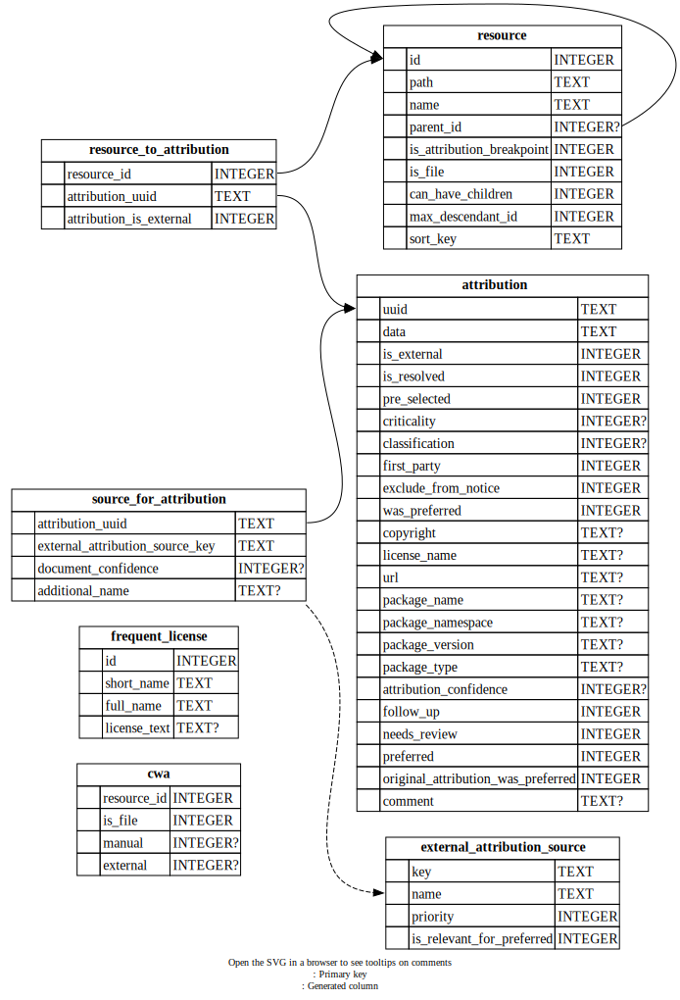

<!--
SPDX-FileCopyrightText: Meta Platforms, Inc. and its affiliates
SPDX-FileCopyrightText: TNG Technology Consulting GmbH <https://www.tngtech.com>

SPDX-License-Identifier: CC0-1.0
-->

# The Architecture of OpossumUI

We started migrating the business logic from the Electron frontend (renderer thread) to the backend (main thread).
This file gives a brief overview of the current state and the new target architecture.

## Old Architecture

Currently, the backend only reads files, preprocesses them, and sends them to the frontend. After a change, the frontend sends the entire mutable part of the file to the backend, which saves it to disk.
The frontend has all of the business logic: it filters, aggregates and cross-references all of the data. Most of that is done on a different thread in the `signals-worker`.

As the decompressed files can get very large (currently up to ~300MB, and we plan to support more than that in the future), this has multiple problems:

- Heap limits
  - In Electron, the JavaScript heap is [limited to 4GB](https://www.electronjs.org/blog/v8-memory-cage). As we save the data not once, but multiple times (in Redux, in the `signals-worker`, in component state, `structuredClone` during sending/receiving, ...), we already hit that limit with large files. This leads to OpossumUI crashing.
- Bandwidth between frontend and backend
  - Transferring hundreds of MB from the backend to the frontend through the IPC channel can take minutes
  - The other direction is less slow, because the mutable part of the data is much smaller, typically tens of MB on large files. However, we do it on every save instead of just at the beginning.
- Slow processing
  - JavaScript is not optimal for queries on large data structures. We have to retrieve values from all other attributions for the autocompletes, or get a list of all resources that have children with incomplete attributions. That can be slow.
- Convoluted data flow
  - The indirection through the `signals-worker` complicates the flow of data. When relevant information in the Redux store is changed, the worker gets notified through a listener which sends an event, recalculates its results, sends an event back, that is then entered into the Redux store. That makes understanding the flow and finding bugs a hard task.

## New Architecture

The main point of the new architecture is to move the data and processing into the backend (main thread) part of the application.

To do that, we use a **new database**, accessible through a **new API**.

### Database

When loading a file, we insert the data into a temporary [SQLite](https://sqlite.org/index.html) database. The database is recreated on every file load, so we don't need to worry about migrations.

See the generated database diagram:

All database access (with exception for bulk writes) should happen through [Kysely](https://kysely.dev/), using `getDb()` from [`db.ts`](src/ElectronBackend/db/db.ts). Kysely is a typesafe way to write SQL queries. For that, we automatically generate [types](src/ElectronBackend/db/generated/databaseTypes.ts).

### API

Commands for querying and mutating data are specified in the backend and made accessible via [`backendClient`](src/Frontend/util/backendClient.ts) to the frontend. This is dynamic, typesafe and without added boilerplate.

Queries and Mutations are handled with Tanstack query.

Queries are automatically cached.
Mutations return a list of names and parameters of queries that are invalidated by them. This is handled transparently, so the frontend code can always rely on the queries being up-to-date.

### Migration strategy

To avoid a big-bang migration, we migrate step-by-step:

1.  Fill the database with data from the loaded file
2.  Reflect all file changes in the database by syncing mutations on save _<- we are here_
3.  Migrate the source of data in the frontend from Redux/the `signals-worker` to backend api queries
4.  Migrate data mutations from Redux to backend api calls
5.  Remove the now unused code, including the `signals-worker` and most of the Redux code

### Future possibilities

There are multiple ways how we could expand on the architecture in the future.

- Use SQLite as [application file format](https://sqlite.org/aff_short.html)
  - Instead of JSON, an `.opossum` file could just be an SQLite DB, which would eliminate the startup loading times.
- Enable collaborative editing
  - SQLite supports multiple writers on the same file. This could be a way to enable collaboration by e.g. opening a DB file from a network drive. This might be unrealistic due to [performance issues](https://sqlite.org/whentouse.html#situations_where_a_client_server_rdbms_may_work_better).
  - Another option might be for one OpossumUI backend to host a server through which collaborators could access the same data.
- Deploy as thin frontend
  - If we have a separation of the frontend and backend where we don't have to transfer the whole file, it would be easy to host the backend and frontend on a server and let the user access it via a browser instead of Electron.
