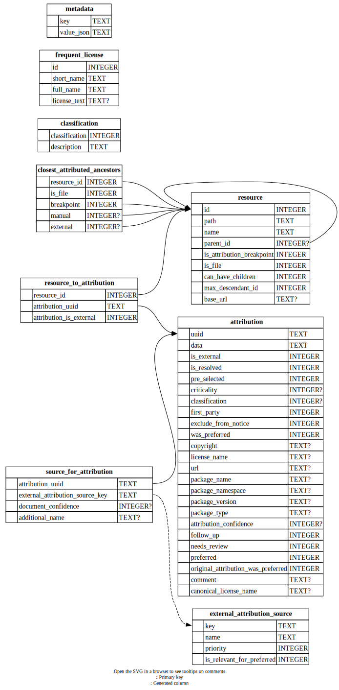

<!--
SPDX-FileCopyrightText: Meta Platforms, Inc. and its affiliates
SPDX-FileCopyrightText: TNG Technology Consulting GmbH <https://www.tngtech.com>

SPDX-License-Identifier: CC0-1.0
-->

# The Architecture of OpossumUI

This file gives a brief overview of the OpossumUI data architecture.

## Architecture

The application data is kept in an SQLite database in the backend and exposed to the frontend through a unified API.

### Database

When loading a file, we insert the data into a temporary [SQLite](https://sqlite.org/index.html) database. The database is recreated on every file load, so we don't need to worry about migrations.

See the generated database diagram:

All database access (with exception for bulk writes) should happen through [Kysely](https://kysely.dev/), using `getDb()` from [`db.ts`](src/ElectronBackend/db/db.ts). Kysely is a typesafe way to write SQL queries. For that, we automatically generate [types](src/ElectronBackend/db/generated/databaseTypes.ts).

### API

Commands for querying and mutating data are specified in the backend and made accessible via [`backendClient`](src/Frontend/util/backendClient.ts) to the frontend. This is dynamic, typesafe and without added boilerplate.

Queries and Mutations are handled with Tanstack query.

Queries are automatically cached.
Mutations return a list of names and parameters of queries that are invalidated by them. This is handled transparently, so the frontend code can always rely on the queries being up-to-date.

### Future possibilities

There are multiple ways how we could expand on the architecture in the future.

- Use SQLite as [application file format](https://sqlite.org/aff_short.html)
  - Instead of JSON, an `.opossum` file could just be an SQLite DB, which would eliminate the startup loading times.
- Enable collaborative editing
  - SQLite supports multiple writers on the same file. This could be a way to enable collaboration by e.g. opening a DB file from a network drive. This might be unrealistic due to [performance issues](https://sqlite.org/whentouse.html#situations_where_a_client_server_rdbms_may_work_better).
  - Another option might be for one OpossumUI backend to host a server through which collaborators could access the same data.
- Deploy as thin frontend
  - If we have a separation of the frontend and backend where we don't have to transfer the whole file, it would be easy to host the backend and frontend on a server and let the user access it via a browser instead of Electron.
