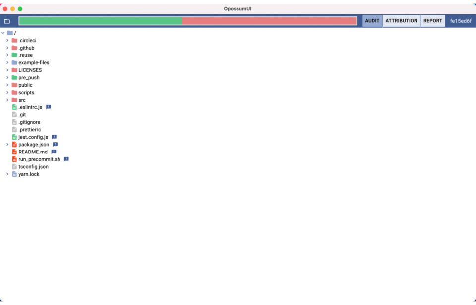

<!--
SPDX-FileCopyrightText: Facebook, Inc. and its affiliates
SPDX-FileCopyrightText: TNG Technology Consulting GmbH <https://www.tngtech.com>

SPDX-License-Identifier: CC0-1.0
-->

# OpossumUI: A compliance audit/review frontend.

OpossumUI is a tool to

* discover open source software used in applications.
* review licenses.
* generate reports from an open source code scan.

## Features

* use of multiple scanners (open source and/or proprietary).
* currently integrates with OSS Review Toolkit and ScanCode.
* unified interface for browsing scanner evidence.
* simple navigation through the codebase’s file tree.
* create attributions for individual files or groups.

[](https://github.com/opossum-tool/opossumUI/blob/main/LICENSES/Apache-2.0.txt)
[](https://api.reuse.software/info/git.fsfe.org/reuse/api)
[](https://github.com/prettier/prettier)



## Use Cases

- A team performing audits for open source license compliance.
- Producing legal docs such as inventory (BOMs) and license conflicts that need to be remediated.
- OpossumUI can be used to visually inspect (QA) existing attributions, identify any false positives or incorrect
  attributions by manual selection and improve existing data.
- To aid M&A due diligence activities. OpossumUI can be used by acquirers for blind audits of intellectual property,
  since only compliance-relevant metadata is exposed in the app without the need to ever share the source code.

## Motivation

OpossumUI was developed with the goal to build a tool for managing and combining open source compliance data from
different sources. While existing analysis tools for software compliance can provide good information, using multiple of
such tools often leads to huge amounts of data due to an increased detection rate. Even though the results can be merged
and noise can be filtered through automatic tools, final manual revisions are often necessary. So, OpossumUI was born: A
light-weight app for review of compliance information for large codebases.

## Integration in the ecosystem

To integrate well with different analysis tools, different converters are provided to generate input files in json
format that can be opened with OpossumUI. After completing the review process with OpossumUI, the information can be
outputted in different formats.


# <a id="user_quick_start_guide"></a> User's Quick Start Guide

## Input and output files

To work with OpossumUI, an input file can be opened to visualize and edit license compliance data of a project. When
opening an input file for the first time, an accompanying output file with the naming convention
"[INPUT NAME]_attributions.json" is created in the same directory as the input file.

## Generating input files

Result files (yaml / json) from the _OSS Review Toolkit_ can be converted into OpossumUI input files via a custom
reporter. It uses metadata from the analyzer as well as scan results from the scanner. The implementation is in the
fork [opossum-tool/oss-review-toolkit](https://github.com/opossum-tool/oss-review-toolkit) and the new reporter output
is called `Opossum`.

For details of the file format, see [Contributing](CONTRIBUTING.md#file_formats)

## How to get & run OpossumUI

### Prerequisites

The following software is required for the building process:

- [git](https://git-scm.com/),
- [node.js](https://nodejs.org/) 14+,
- [yarn](https://yarnpkg.com/en/),
- [wine](https://www.winehq.org/) (only to build the Windows version on a Unix-based OS).

### Repo setup

Clone the OpossumUI repo. E.g. run the following command in a terminal:

```bash
git clone git@github.com:opossum-tool/opossumUI.git
```

To install dependencies and set up the working environment, run:

```bash
yarn install
```

### Building on a Unix-based system (linux, macOS)

To build for a single OS run either `yarn ship-linux`, `yarn ship-mac` or `yarn ship-win`. **Important:** wine must be
installed to build a Windows installer. To build for all three systems run `yarn ship`.

The built release(s) can be found under _/release/linux_and_windows_ or _/release/macOS_

### Building on Windows

To build a Windows installer run `yarn win-ship-win`. Building of non-Windows version on Windows is currently not
supported.

*WARNING: The repo has to be cloned with `lf` unix-style line ending.*

### Running the app

#### Linux

Run the executable _opossum-ui-0.1.0.AppImage_

#### macOS

Run _opossum-ui_ in _opossum-ui-darwin-x64/_.

#### Windows

Run _opossum-ui Setup 0.1.0.exe_ to install the OpossumUI. Then open _opossum-ui_ from the start menu.

## Working with OpossumUI

For an in-depth explanation, read the [Users's Guide](USER_GUIDE.md).

### Exporting data

In addition to the default output file, OpossumUI provides the following export options.

### Exporting SPDX documents:

An SPDX document can be exported in the json and the yaml format through the _Export_ ⟶ _SPDX (yaml)_ and _SPDX (json)_
option in the _File_ menu.

### Exporting BOM-like CSV files:

These can be exported through the _Export_ ⟶ _Compact / Detailed component list_ option in the _File_ menu. Both
component list files contain a list of all attributions that are present in the project, including package name,
version, copyright, license name and URL. In addition, the detailed component list is more comprehensive and includes
the PURL and its subcomponents, as well as the license texts.

### Exporting follow-up document:

This can be exported through the _Export_ ⟶ _Follow-Up_ option in the _File_ menu. Similar to the component list, it
contains attributions with licenses flagged for legal review through the _Follow-Up_ checkbox in the UI.

## Limitations

SPDX License Expressions are only partially supported at the moment. Currently, a license expression can only be entered
as license name of a package. The full license text of the different licenses (e.g. GPL-2.0-only OR BSD-2-Clause) that
apply should also be entered in the license text field.

# Developer's guide

Contributions to the project are welcome. See [Contributing](CONTRIBUTING.md).

## Licensing

OpossumUI is licensed under [Apache-2.0](LICENSE), documentation is licensed under CC0-1.0. For Contributions, we use
the Developer Certificate of Origin ([DCO](DCO.md)) process via sign-offs in every commit, to help ensure licensing
criteria are met.
