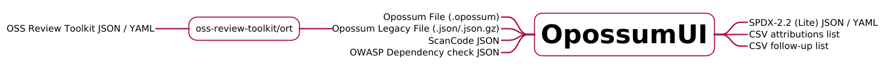

<!--
SPDX-FileCopyrightText: Meta Platforms, Inc. and its affiliates
SPDX-FileCopyrightText: TNG Technology Consulting GmbH <https://www.tngtech.com>

SPDX-License-Identifier: CC0-1.0
-->


# OpossumUI: A compliance audit/review frontend.

OpossumUI is a tool to

- discover open source software used in applications.
- review licenses.
- generate reports from an open source code scan.

## Features

- use of multiple scanners (open source and/or proprietary).
- currently integrates with OSS Review Toolkit, FOSSLight and ScanCode.
- unified interface for browsing scanner evidence.
- simple navigation through the codebase’s file tree.
- create attributions for individual files or groups.

[](https://github.com/opossum-tool/opossumUI/blob/main/LICENSES/Apache-2.0.txt)
[](https://api.reuse.software/info/git.fsfe.org/reuse/api)
[](https://github.com/opossum-tool/opossumUI/releases/latest)


## Use Cases

- A team performing audits for open source license compliance.
- Producing legal docs such as inventory (BOMs) and license conflicts that need to be remediated.
- OpossumUI can be used to visually inspect (QA) existing attributions, identify any false positives or incorrect
  attributions by manual selection and improve existing data.
- To aid M&A due diligence activities. OpossumUI can be used by acquirers for blind audits of intellectual property,
  since only compliance-relevant metadata is exposed in the app without the need to ever share the source code.

## Motivation

OpossumUI was developed with the goal to build a tool for managing and combining open source compliance data from
different sources. While existing analysis tools for software compliance can provide good information, using multiple of
such tools often leads to huge amounts of data due to an increased detection rate. Even though the results can be merged
and noise can be filtered through automatic tools, final manual revisions are often necessary. So, OpossumUI was born: A
light-weight app for review of compliance information for large codebases.

## Integration in the ecosystem

To integrate well with different analysis tools, different converters are provided to generate input files in json
format that can be opened with OpossumUI. After completing the review process with OpossumUI, the information can be
outputted in different formats.



# Getting Started

## Input files

To work with OpossumUI, an input file can be opened to visualize and edit license compliance data of a project.
Input files typically have the file ending `.opossum`, while opening the deprecated file format that has the file ending
`.json` is still supported. In this case the app will inform the user that the deprecated file format is automatically
converted to the new file format.

## Generating input files

Result files from _ScanCode_ and _SCANOSS_ can be converted into OpossumUI input files using
[opossum-tool/opossum.lib.hs](https://github.com/opossum-tool/opossum.lib.hs). This tool can also generate
OpossumUI input files from spdx and merge several OpossumUI input files.

Result files (yaml / json) from the _OSS Review Toolkit_ can be converted into OpossumUI input files via a
reporter. It uses metadata from the analyzer as well as scan results from the scanner. The implementation is in
[oss-review-toolkit/ort](https://github.com/oss-review-toolkit/ort) and the new reporter output
is called `Opossum`.

For details of the file format, see [file formats](#file-formats).

## How to get and run OpossumUI

Check out our short getting started video:

[](https://www.youtube.com/watch?v=tXMV04f-CHg)

### Get the latest release

Download the latest release for your OS from [GitHub](https://github.com/opossum-tool/OpossumUI/releases/latest).

### Running the app

#### Linux

Run the executable _OpossumUI-for-linux.AppImage_

#### macOS

Run _OpossumUI_ in _OpossumUI-for-mac.zip_.

#### Windows

Run _OpossumUI-for-win.exe_ to install the OpossumUI. Then open _OpossumUI_ from the start menu.

## Working with OpossumUI

Check out our [short video](https://youtu.be/bqGX9IQYpJY?si=BjNeCi9osPWy7z1H), which presents a basic workflow.

For an in-depth explanation, please read the [Users's Guide](USER_GUIDE.md).

## File formats

Files with a `.opossum` extension are zip-archives which contain an `input.json` (must be provided) together with an `output.json` (optional).
JSON schemas for both the [input](src/ElectronBackend/input/OpossumInputFileSchema.json)
and [output](src/ElectronBackend/input/OpossumOutputFileSchema.json) files are available. Example files can be found
under [example files](example-files/).

### Input file

It has to be generated through external tools and provided to the app. Contains 5 main fields:

- `metadata`: contains some project-level information,
- `resources`: defines the file tree,
- `externalAttributions`: contains all attributions which are provided as signals (preselected signals will be
  automatically used by the app to create attributions in the output file),
- `resourcesToAttributions`: links attributions to file paths,

There are additional fields which are optional:

- `frequentLicenses`: A list of licenses that can be selected in a dropdown when the user enters a license name.
- `attributionBreakpoints`: a list of folder paths where attribution inference stops, e.g. `node_modules`."
- `filesWithChildren`: a list of folders that are treated as files. This can be used to attach another file tree to
  files like `package.json`, usually also setting an attribution breakpoint.
- `baseUrlsForSources`: a map from paths to the respective base url. The base url should contain a {path} placeholder.
  E.g.

  ```json
  "baseUrlsForSources": {
    "/": "https://github.com/opossum-tool/opossumUI/blob/main/{path}"
  }
  ```

- `externalAttributionSources`: used to store a mapping of short names for attribution sources to full names and priorities used for sorting in the PackagePanel. Entries with higher numbers have a higher priority. E.g.:

  ```json
  "externalAttributionSources": {
    "SC": {
      "name": "ScanCode",
      "priority": 1
    }
  }
  ```

### Output file

Contains four main fields:

- `metadata`: contains some project-level information,
- `manualAttributions`: contains all attributions created by the user or preselected,
- `resourcesToAttributions`: links attributions to file paths,
- `resolvedExternalAttributions`: used to store which signal attributions have been resolved, as they are hidden in the
  UI.

### Exporting data

In addition to the default output file, OpossumUI provides the following export options.

#### Exporting SPDX documents

An SPDX document can be exported in the json and the yaml format through the _Export_ ⟶ _SPDX (yaml)_ and _SPDX (json)_
option in the _File_ menu.

#### Exporting BOM-like CSV files

These can be exported through the _Export_ ⟶ _Compact / Detailed component list_ option in the _File_ menu. Both
component list files contain a list of all attributions that are present in the project, including package name,
version, copyright, license name and URL. In addition, the detailed component list is more comprehensive and includes
the PURL and its subcomponents, as well as the license texts.

#### Exporting follow-up document

This can be exported through the _Export_ ⟶ _Follow-Up_ option in the _File_ menu. Similar to the component list, it
contains attributions with licenses flagged for legal review through the _Follow-Up_ checkbox in the UI.

## Limitations

SPDX License Expressions are only partially supported at the moment. Currently, a license expression can only be entered
as license name of a package. The full license text of the different licenses (e.g. GPL-2.0-only OR BSD-2-Clause) that
apply should also be entered in the license text field.

# Developer's guide

Contributions to the project are welcome. See [Contributing](CONTRIBUTING.md).

## Licensing

OpossumUI is licensed under [Apache-2.0](LICENSE), documentation is licensed under CC0-1.0. For contributions, we use
the Developer Certificate of Origin ([DCO](DCO.md)) process via sign-offs in every commit, to help ensure licensing
criteria are met.
