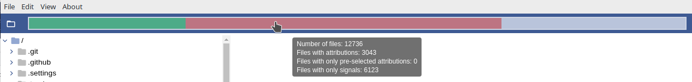
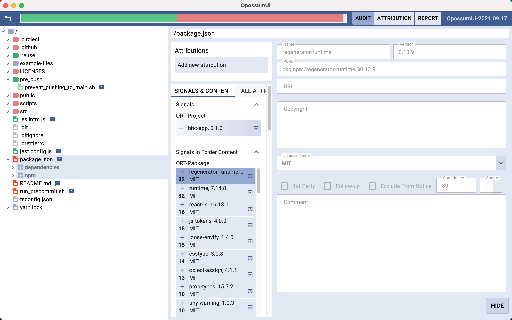
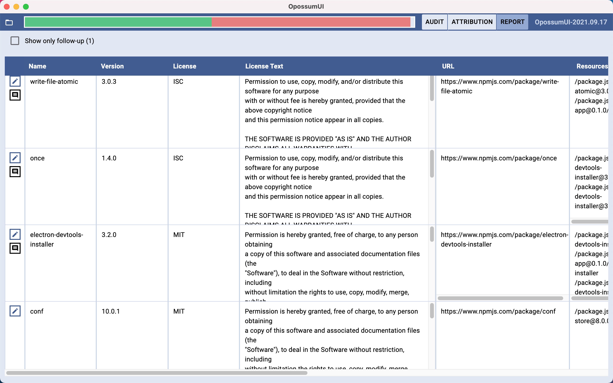
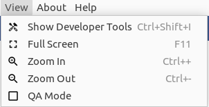
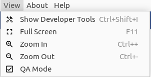

<!--
SPDX-FileCopyrightText: Meta Platforms, Inc. and its affiliates
SPDX-FileCopyrightText: TNG Technology Consulting GmbH <https://www.tngtech.com>

SPDX-License-Identifier: CC0-1.0
-->

# User Guide

## Table of contents

- [Getting Started](#getting-started)
  - [Get the latest release](#get-the-latest-release)
  - [Running the app](#running-the-app)
- [Working with OpossumUI](#working-with-opossumui)
  - [Opossum file format](#opossum-file-format)
  - [JSON files](#json-files)
  - [Opening a file](#opening-a-file)
  - [Project Metadata](#project-metadata)
  - [Project Statistics](#project-statistics)
  - [Exporting Formats](#exporting-formats)
  - [Attributions](#attributions)
  - [Top Bar](#top-bar)
  - [Audit View](#audit-view)
  - [Report View](#report-view)
  - [Preferred Attributions](#preferred-attributions)

## Getting Started

### Get the latest release

Download the latest release for your OS from [GitHub](https://github.com/opossum-tool/OpossumUI/releases/latest).

To check if your installation is up to date, open the `Help` menu and select `Check for updates`.

### Running the app

#### Linux

Run the executable _OpossumUI-for-linux.AppImage_

#### macOS

Run _OpossumUI_ in _OpossumUI-for-mac.zip_.

#### Windows

Run _OpossumUI-for-win.exe_ to install the OpossumUI. Then open _OpossumUI_ from the start menu.

## Working with OpossumUI

### Opossum file format

Files with a `.opossum` extension are zip-archives which contain an _input.json_ (must be provided) together with an _output.json_ (optional). An output file will be automatically created and added to the archive after opening the archive if there is no such file yet.

### JSON files

Two .JSON files are used by the app to store data:

- an input file, that must be provided,
- an output file, which is created by the app when saving for the first time if not already present.

The output file must be in the same folder as the input file and called `[NAME_OF_THE_FIRST_FILE]_attributions.json`
to be recognized by the app.

### Opening a File

To open the input file in the app, click the _Open File_ button on the left of the top bar (or on the entry in the _File_ menu with the same name).

If you try to open a _.json_ file, a popup will be shown which asks whether you would like to create a `.opossum` file and proceed (recommended) or continue working with the old format (two separate _.json_ files).

### Project Metadata

To view project metadata, open the `File` menu and select `Project Metadata`.

### Project Statistics

To view project statistics, open the `File` menu and select `Project Statistics`. This opens a popup that shows various
tables and pie charts summarizing the state of the project.

### Exporting Formats

It is possible to directly export data to files. The following formats are available:

- Follow-Up: Just the items marked as follow-up are present in this file as csv file.
- Compact component list: All attributions not marked as follow-up or 1st Party are exported to a csv file. Attributions marked as "exclude from notice" are not exported.
- Detailed component list: All attributions not marked as follow-up or 1st Party are exported to a csv file.
- SPDX JSON: All attributions are listed as JSON file.
- SPDX YAML: All attributions are listed as YAML file.

To generate a document, open the `File` menu and select `Export`.

### Attributions

The basic building block of license/attribution information in the OpossumUI is the **Attribution**. An **Attribution**
isn't only a software package with name & version (or PURL) and copyright, distributed under one or more licenses. It
can in principle be any file which has a copyright or is distributed under a license. **The purpose of the OpossumUI is to
link resources to the corresponding attributions, with an emphasis on correct licensing and copyright information.**
In the OpossumUI, a distinction between **signals** and **attributions** is made:

- **attributions** are attribution information that are created in the current run of the OpossumUI. They are stored in
  the output file, together with the resources they have been linked to,
- **signals** are attribution information that have been linked to a resource before the current OpossumUI run. They can
  come from automatic tools or previous run of the OpossumUI. They have a **source** and can be used as starting point for
  assigning attributions.

### Top Bar

In the `Top Bar`, the following elements are present:

- the _Open File_ button,
- the `Progress Bar`,
- the `Progress Bar Toggle`,
- the `View Switch`,
- the app version,
- the path bar.

The `Progress Bar` indicates how many files have manually received an attribution (dark green), how many have an automatically **pre-selected** attribution (lighter green with gradient), and how many files have a signal, but have not yet received an attribution (orange), with respect to the total number of files. Hovering on the bar shows a tooltip containing all four numbers. Clicking on the bar navigates to a file that has a signal, but no attribution.

Clicking the `Progress Bar Toggle` replaces the `Progress Bar` by the `Critical Signals Progress Bar`. The `Critical Signals Progress Bar` indicates how many files have a highly critical signal but no attribution (red), a critical signal but no attribution (orange) with respect to the total number of files not having an attribution. Hovering on the bar shows a tooltip containing all 4 numbers. Clicking on the bar navigates to a file that has a critical signal,
but no attribution.

The `View Switch` allows to change between the `Audit View` and the `Report View`.

The `path bar` shows the path of the currently selected resource. It also provides opens to navigate back and forth in the selection history, to copy the path to the clipboard, and, if possible, to open the resource's source repository in a browser.

### Audit View

**Resource** is the generic name used throughout the app to indicate a file or a folder (as in many cases they are treated the same). The `Audit View` focuses on the navigation through the resources to add/edit/remove attributions while seeing which signals have been found by the remote tools. The page has three main components:

- a resource browser on the left,
- panels to list attributions and signals on the selected resource in the middle,
- and attribution details, if an attribution or signal has been selected, on the right.

#### Resource Browser

In the resource browser, resources can be selected for assigning attributions or inspecting signals. **Icons** help to find information in the folder
structure:

- a **file icon**  indicates that the resource is a file,
- a **folder icon**  indicates that the resource is a folder,
- a **icon consisting of four squares**  indicates that the resource is a breakpoint (**breakpoints** are special folders
  that are included to visually collect a set of dependencies. These folders cannot have any signal or attribution.
  Furthermore, no attribution is inferred beyond such a breakpoint),
- a **exclamation mark**  indicates the presence of signals attached to the resource.

The coloring scheme reads as follows:

- **red** indicates the presence of signals but no attribution for the resource itself,
- **green** indicates the presence of attribution for the resource itself,
- **light red** indicates the presence of signals but no attribution in children,
- **light green** indicates the presence of attribution in children,
- **grey** indicates the absence of both, signals and attribution, in children,
- **blue** indicates the presence of signals in children but no attribution of the resource itself.

Please note that in case a resource has an attribution, this attribution also applies to all of its children that do not have attributions of their own. Therefore, adding an attribution to a folder affects its children if these are not attributed themselves. The inference stops once a folder or a file is hit that has a differing attribution.

At the bottom of the resource browser you will find a panel listing resources linked to the selected attribution or signal.

#### Attributions Panel

The attributions panel lists attributions as they relate to the selected resource. The possible relationships, by which attributions are grouped into tabs, are:

- **on the selected resource:** attributions directly assigned to the selected resource
- **on children of the selected resource:** attributions assigned to resources contained in the selected resource
- **on parents of the selected resource:** attributions assigned to resources containing the selected resource
- **unrelated:** attributions that are not directly or indirectly linked to the selected resource

Besides searching, sorting, and filtering attributions according to your needs, you can also perform any of the following actions:

- **create new attribution:** creates a new attribution on the selected resource from scratch
- **link as attribution on selected resource:** links the selected attributions to the selected resource (only available if some of the selected attributions are not already linked)
- **confirm:** confirms any of the selected attributions which are pre-selected (P)
- **replace:** enters replacement mode during which you can select a replacement for the selected attributions
- **delete:** deletes the selected attributions

#### Signals Panel

The signals panel lists signals as they relate to the selected resource. The possible relationships, by which attributions are grouped into tabs, are:

- **on the selected resource:** attributions directly assigned to the selected resource
- **on children of the selected resource:** attributions assigned to resources contained in the selected resource

Besides searching, sorting, and filtering signals according to your needs, you can also perform any of the following actions:

- **link as attribution on selected resource:** converts the selected signals to attributions and links them to the selected resource
- **delete:** soft-deletes the selected signals, i.e., hides them from the list
- **restore:** restores the selected soft-deleted signals (only available when you include the deleted signals via the show/hide button)
- **show/hide deleted signals:** shows/hides the soft-deleted signals

#### Attribution Details

The attribution details show the attributes of the selected attribution or signal. It is here that you can edit and save details of attributions as well. Signals can never be edited (only hidden).

The attributes are divided into three categories:

- **auditing options:** certain annotations and tags that facilitate the auditing process
- **package coordinates:** attributes used to uniquely identify the package
- **legal information:** attributes used to describe the OSS licensing aspects of the package

##### Auditing Options

- _Exclude From Notice_: If chosen, the relative attribution will not be shown in the notice document. In the case of first party code, the respective flag should be used. _Exclude From Notice_ should be used only if:
  - the content of the attribution does not need attribution or
  - the attribution isn't an actual attribution or
  - it was globally decided that this attribution does not need attribution (e.g. it is proprietary but bought for the whole company).
- _Needs Review by QA_: This flag can be used to signal to another OpossumUI user, for example someone performing quality assurance, that an attribution needs review.
- _Needs Follow-Up_: This flag can be used to indicate that the attribution requires follow-up, usually with the development team, as it would be part of a blacklist.
- _Confidence_: This field is used to indicate the confidence in the correctness of the attribution. It is a emoticon on a scale of 1 to 5. You can also filter for attributions with low confidence in the attributions panel.

##### Package Coordinates

These coordinates serve to uniquely identify the package. In particular, package name and package type are required information from which a PURL ("Package URL") is automatically generated. Some package types also require the presence of a namespace. For example, GitHub and Maven packages require a namespace, while NPM packages do not.

Also try to fill the repository URL of the attribution as it often helps to automatically compute the correct license information from it.

Be aware that different package versions may result in different license information. Thus, providing a version whenever possible is also very helpful.

##### Legal Information

Copyright and license name are the most important part of an attribution when it comes to OSS compliance. However, if you are dealing with first-party code, then please select this option in this section. You then no longer will be asked to supply copyright and license name.

##### Comparing an Attribution to its Original Signal

If an attribution originates from a signal, a `Compare to Original Signal` icon button will be displayed in the row of buttons at the bottom of the attribution details. Clicking this button opens a popup where the package coordinates and legal information of both the current attribution and its original signal are displayed side-by-side. Attributes that have changed are highlighted by colored outlines.

You can revert individual attributes to their original state by pressing the arrow button inside the field. The action can be undone using the same button, which will point in the opposite direction after a revert. Additionally, all changes can be reverted at once by pressing the `Revert All` button of the popup. Changes are applied to the attribution once the `Apply Changes` button is pressed, which also closes the popup.

### Report View

In the `Report View` all attributions together with most of their attributes are shown in a table to provide a scrollable overview. As in the attributions panel, you can filter attributions by pressing the funnel icon in the top-left corner.

Clicking on the _edit_ buttons in the _name_ columns, navigates to the respective attribution in the `Audit View`.

### Preferred Attributions

In the `Audit View`, an attribution can be marked as preferred to indicate that it is preferred over the displayed signals. This feature does not have any immediate effect on the signals displayed in OpossumUI. Instead, it is intended to give additional information to tools that consume `.opossum` files. A preferred attribution will store origin IDs of signals visible to the user when it was marked as preferred.

Only signals with a source marked as `isRelevantForPreference` can be preferred over. If no signal source has this flag set, the feature is disabled.

To mark an attribution as preferred, choose an attribution in the `Audit View`, and open the auditing options menu. You will see an option to mark the attribution as preferred. When an attribution is marked as preferred, `preferred = true` is written to the `.opossum` file, and the origin IDs of all visible signals relevant for preference are written in the field `preferredOverOriginIds`. Preferred attributions are displayed with a star icon.

Note that you are only able to mark an attribution as preferred (or unmark it if it was preferred beforehand) if you are in "QA Mode". To enable this mode click the item "QA Mode" in the `View` submenu.

If "QA Mode" is enabled the icon will change as in the screenshot below.

