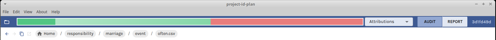
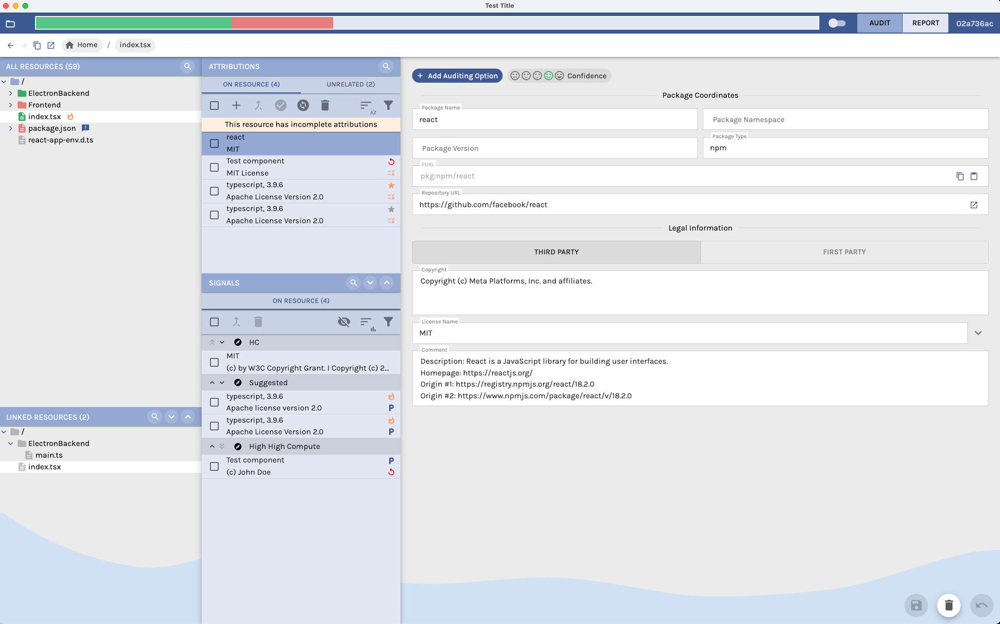

<!--
SPDX-FileCopyrightText: Meta Platforms, Inc. and its affiliates
SPDX-FileCopyrightText: TNG Technology Consulting GmbH <https://www.tngtech.com>

SPDX-License-Identifier: CC0-1.0
-->

# User's Guide

## How to get & run OpossumUI

### Get the latest release

Download the latest release for your OS from [Github](https://github.com/opossum-tool/OpossumUI/releases/latest).

### Running the app

#### Linux

Run the executable _OpossumUI-for-linux.AppImage_

#### macOS

Run _OpossumUI_ in _OpossumUI-for-mac.zip_.

#### Windows

Run _OpossumUI-for-win.exe_ to install the OpossumUI. Then open _OpossumUI_ from the start menu.

## Working with OpossumUI

### Opening a File

Two .json files are used by the app to store data:

- an input file, that must be provided,
- an output file, which is created by the app when saving for the first time if not already present.

The output file must be in the same folder as the input file and called `[NAME_OF_THE_FIRST_FILE]_attributions.json`
to be recognized by the app.

To open the input file in the app, click the _Open File_ button on the left of the top bar (or on the entry in the
_File_ menu with the same name).

### Search

To search for a path, press `CTRL + F` or open the `Edit` menu and select `Search for Files and Folders`.

### View Project Metadata

To view project metadata, open the `File` menu and select `Show Project Metadata`.

### Exporting Formats

It is possible to directly export data to files. The following formats are available:

- Follow-Up: Just the items marked as follow-up are present in this file as csv file.
- Compact component list: All attributions not marked as follow-up or 1st Party are exported to a csv file. Attributions marked as "exclude from notice" are not exported.
- Detailed component list: All attributions not marked as follow-up or 1st Party are exported to a csv file.
- SPDX JSON: All attributions are listed as JSON file.
- SPDX YAML: All attributions are listed as YAML file.

To generate a document, open the `File` menu and select `Export`.

### Attributions

The basic building block of license/attribution information in the opossumUI is the **Attribution**. An **Attribution**
isn't only a software package with name & version (or purl) and copyright, distributed under one or more licenses. It
can in principle be any file which has a copyright or is distributed under a license. **The purpose of the opossumUI is to
link resources to the corresponding attributions, with an emphasis on correct licensing and copyright information.**
In the opossumUI, a distinction between **signals** and **attributions** is made:

- **attributions** are attribution information that are created in the current run of the opossumUI. They are stored in
  the output file, together with the resources they have been linked to,
- **signals** are attribution information that have been linked to a resource before the current opossumUI run. They can
  come from automatic tools or previous run of the opossumUI. They have a **source** and can be used as starting point for
  assigning attributions.

### Top Bar

In the `Top Bar`, the following elements are present. From left to right:

- the _Open File_ button (read _Open File_ section to learn more about opening a file),
- the `Progress Bar` (shown only if a file is open),
- the `View Switch`,
- the app version.

The `Progress Bar` indicates how many files have manually received an attribution (dark green), how many have an
automatically **pre-selected** attribution (lighter green with gradient) and how many files have a signal, but have not
yet received an attribution (orange), with respect to the total number of files. Hovering on the bar shows a tooltip
containing all 4 numbers. Clicking on the bar navigates to a file that has a signal, but no attribution.

The `View Switch` allows to change between the `Audit View`, the `Attribution View`, and the `Report View` (the views
are described in more detail in the respective sections).

The app version is crucial to allow the development team to reproduce bugs: please always include it in
screenshots/videos/emails documenting a bug.

### Audit View

**Resource** is the generic name used throughout the app to indicate a file or a folder (as in many cases they are
treated the same). The `Audit View` focuses on the navigation through the resources to add/edit/remove attributions
while seeing which signals have been found by the remote tools. The page has two main components:

- a `Resource Tree` on the left,
- a `Selected Resource Panel` on the center right (shown only if a resource has been selected in the `Resource Tree`).

#### Folders and inferred attributions

In the case that a folder receives an attribution this attribution is also inferred to all its children that
do not have their own attribution. Therefore, adding an attribution to a folder affects its children if these
are not attributed themselves. The inference stops once a folder or a file is hit that has a differing attribution.

#### Resource Tree

In the `Resource Tree` resources can be selected. **Icons** help to find information in the folder
structure:

- a **file icon**  indicates that the resource is a file,
- a **folder icon**  indicates that the resource is a folder,
- a **icon consisting of four squares**  indicates that the resource is a breakpoint (**breakpoints** are special folders
that are included to visually collect a set of dependencies. These folders cannot have any signal or attribution.
Furthermore, no attribution is inferred beyond such a breakpoint),
- a **exclamation mark**  indicates the presence of signals attached to the resource.

The coloring scheme reads as follows:

- **red** indicates the presence of signals but no attribution for the resource itself,
- **green** indicates the presence of attribution for the resource itself,
- **light red** indicates the presence of signals but no attribution in children,
- **light green** indicates the presence of attribution in children,
- **grey** indicates the absence of both, signals and attribution, in children,
- **blue** indicates the presence of signals in children but no attribution of the resource itself.

#### Selected Resource Panel

The `Selected Resource Panel` shows the path of the selected resource at the top. If the input file contains information
about the location of the file (`baseUrlsForSources`) an icon to externally open the file is shown.

Below the path, the element is divided into two columns. In the `Attribution Selection Column`, in the center of the
screen, attributions and signals related to the selected resource are listed. In the `Attribution Details Column` on
the right, additional information is shown for the selected attribution/signal.

##### Attribution Selection Column

In the `Attribution Selection Column` the following sub-panels may be present:

- `Attribution Sub-Panel` (always shown),
- `Signals Sub-Panel` (accessible via the `LOCAL` tab),
- `Attributions in Folder Content Sub-Panel` (accessible via the `LOCAL` tab),
- `Signals in Folder Content Sub-Panel` (accessible via the `LOCAL` tab),
- `Add to Attribution Sub-Panel` (accessible via the `GLOBAL` tab).

The `Attributions Sub-Panel` shows a list of all attributions that are assigned to the selected resource.
**Pre-selected** attributions are signaled by an `P` icon. They can be confirmed, therefore being considered
attributions in all views and in the progress bar. However, that is not a requirement. **Pre-selected** and
attributions are both written in the output file. Clicking on one of the
attributions, shows the details of that attribution in the `Attribution Details Column`. Clicking on _Add new
attribution_ shows a blank `Attribution Details Column` that allows for adding a new attribution to the list of
attributions, upon saving. If the shown attributions are inferred from a containing folder, they cannot be modified.
Instead, the
_OVERRIDE PARENT_ button can be clicked for creating new attributions for the selected resource. (Note that attributions
are not saved separately, if they are identical to the attributions of a containing folder and can thus be inferred.)

The `Signals Sub-Panel`, `Attributions in Folder Content Sub-Panel` and `Signals in Folder Content Sub-Panel` show lists
of the signals of the selected resource and the attributions and signals of the resources contained within the selected
folder. Clicking on the one of the listed items, shows the details of the respective attribution/signal in the
`Attribution Details Column`. By clicking the **+ icon** of an item, the respective attribution/signal can be added to
the attributions of the selected resource. In the `Signals Sub-Panel` signals that were used to create the pre-selected
attributions are shown with an `P` icon, even if the relative attributions have been deleted. The cards in the
` ... in folder content` sub-panels also show the number of resources in the folder that are linked to the shown
attribution.

The `Add to Attribution Sub-Panel` allows to add an existing attribution to the attributions of the selected resource.
As in the other panels, the details of the attributions can be shown by clicking on the respective list item, while the
attribution can be added by clicking on the corresponding **+ icon**.

#### Attribution Details Column

The `Attribution Details Column` is used in the `Audit View` and in the `Attribution View` (see next section) to show
details of the selected attribution and to edit and save the information of the selected attribution. Note that inferred
attribution information and signals cannot be edited.

IMPORTANT: Some fields in the column have special meanings/behaviors:

- _PURL_: if provided, package name and version are extracted from it, and the corresponding fields are not editable. A
  basic validity check is done on the purl: if the purl text is red it means it is invalid and saving is prevented.
- _License Text_: it will appear in the attributions document. It will be automatically filled in for licenses suggested
  in the license name dropdown.
- _Exclude From Notice Checkbox_: if checked, the relative attribution will not be shown in the notice document.
  In the case of first party code the respective flag should be preferred.
  _Exclude From Notice Checkbox_ should be used only if:
  - the content of the attribution does not need attribution or
  - the attribution isn't an actual attribution or
  - it was globally decided that this attribution does not need attribution (e.g. it is proprietary but bought for the
    whole company).

The `Attribution Details Column`, if editable, shows the following buttons:

- _SAVE_, saves the edited information for the selected resource only, removing the **pre-selected** attribute if
  present.
- _SAVE GLOBALLY_, (shown only if the attribution of the selected resource is also linked to other resources) saves the
  changes for all the linked resources. The same can also be done by pressing _Ctrl + S_.
- _CONFIRM_, removes the **pre-selected** attribute from the attribution for the selected resource only.
- _CONFIRM GLOBALLY_, (shown only if the attribution of the selected resource is also linked to other resources) removes
  the **pre-selected** attribute from the attribution for all linked resources.
- _..._, opens a menu with the following buttons:
  - _Undo_, discards the changes,
  - _Delete_, deletes the attribution of the selected resource only.
  - _Delete Globally_, (shown only if the attribution of the selected resource is also linked to other resources)
    deletes the attribution for all the linked resources.
- _Mark for replacement_, allows to mark an attribution for replacement. After marking an attribution.
  One can navigate to another attribution and press the _Replace marked_ button. This opens a popup. In the popup,
  clicking the _Replace_ button removes the marked attribution and replaces it by the currently selected one.

The _SAVE_ / _SAVE GLOBALLY_ and _Undo_ buttons are disabled if no change has been made.

When all fields except for the _confidence_ field are empty, pressing the _SAVE_ or the _SAVE GLOBALLY_ button deletes
the respective attribution.

The `Attribution Details Column`, when a signal is selected, shows the _HIDE_ button. It can be used to hide the given
signal in the App for the current input/output files, and it will not have any consequence in the DB.

Instead of the buttons, the context menu can be used to execute all available actions out of _Delete_,
_Delete Globally_, _Confirm_, _Confirm Globally_, _Mark for replacement_, _Hide_ and _Show Resources_. To open the
context menu, right-click a signal or an attribution, e.g. in the `Attributions Sub-Panel`, `Signals Sub-Panel` or
`Attribution List`.

### Attribution View

In the `Attribution View` all attributions are listed and can be viewed and edited. The page is in structure similar to
the `Audit View` and has two main components:

- an `Attribution List` on the left,
- a `Selected Attribution Panel` on the center right (shown only if an attribution has been selected from the list).

#### Attribution List

All existing attributions are listed and can be selected. **Pre-selected**
attributions are signaled by an `P` icon. They can be confirmed, which converts them into attributions
in all views and in the progress bar. However, that is not a requirement. **Pre-selected** and manual
attributions are both written in the output file. On top there is an icon for opening the filter section. By clicking
on it, a dropdown will be shown with filters that allows for filtering for attributions marked for follow-up, first
party and not first party. The last two are mutually exclusive. Additionally, the attribution view has a multi-select
mode. If at least one attribution has a checked checkbox, the context menu displays the
_Delete selected globally_ and the _Confirm selected globally_ options. The first option deletes all selected
attributions, after confirming the deletions in a pop-up. The second one confirms all selected attributions.

#### Selected Attribution Panel

The `Selected Attribution Panel` looks much like the `Selected Resource Panel`. The main differences are:

- Only information for the **selected attribution** are shown, in a fashion almost identical to
  the `Selected Resource Panel`. They are always editable.
- The _SAVE_ and _Delete_ buttons allow saving/deleting the selected attribution. Note that the changes affect multiple
  resources if the selected attribution is linked to multiple resources.
- A `Resource List` shows the path of all resources linked to the selected attribution. Clicking on a path shows the
  selected resource in the `Audit View`.

### Report View

In the `Report View` all attributions are shown in a table to provide an overview. On top there is a dropdown list with
filters that allows for filtering for attributions marked for follow-up, first party and not first party. The last two
are mutually exclusive.

Clicking on the _edit_ buttons in the _name_ columns, navigates to the respective attribution in the `attribution view`.
